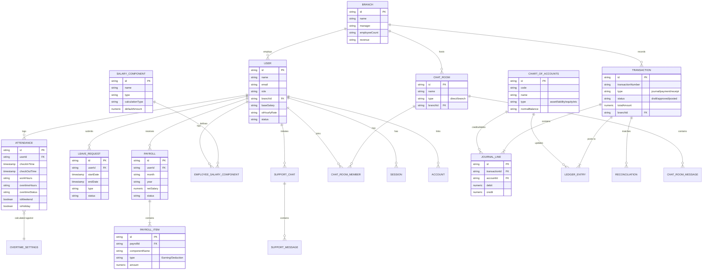

# Finova System Architecture & Entity Relationship Diagram

This document contains the Entity Relationship (ER) Diagram for the Finova platform, detailing how different modules (Users, HR, Payroll, Accounting, and Chat) interconnect.

## Entity Relationship Diagram

## Module Clusters

1. **HR & Personnel:** `USER`, `BRANCH`, `ATTENDANCE`, `LEAVE_REQUEST`, `OVERTIME_SETTINGS`, `HOLIDAY`
2. **Payroll:** `PAYROLL`, `PAYROLL_ITEM`, `SALARY_COMPONENT`, `EMPLOYEE_SALARY_COMPONENT`
3. **Accounting:** `TRANSACTION`, `CHART_OF_ACCOUNTS`, `JOURNAL_LINE`, `LEDGER_ENTRY`, `RECONCILIATION`
4. **Communication:** `CHAT_ROOM`, `CHAT_ROOM_MESSAGE`, `SUPPORT_CHAT`, `SUPPORT_MESSAGE`
5. **Auth & Security:** `SESSION`, `ACCOUNT`, `VERIFICATION`
