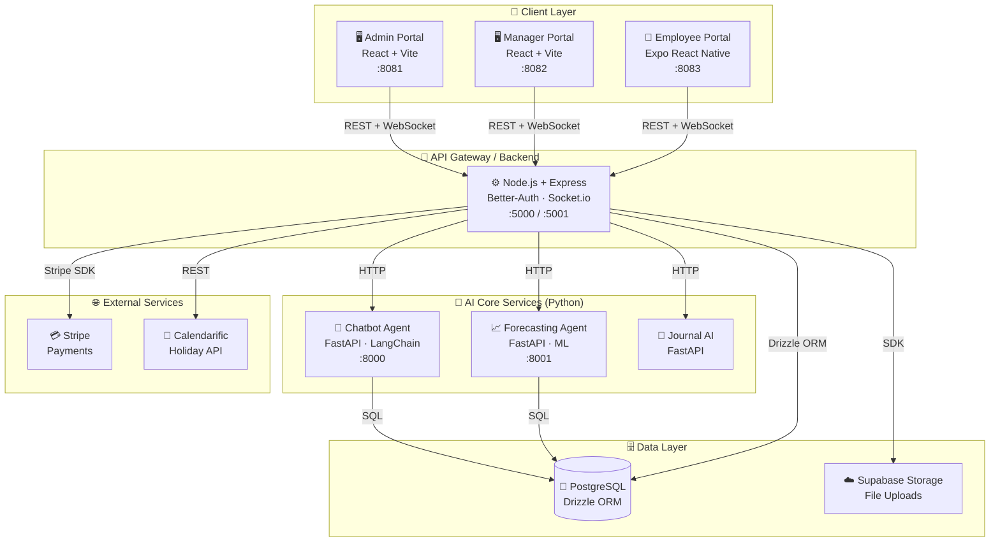
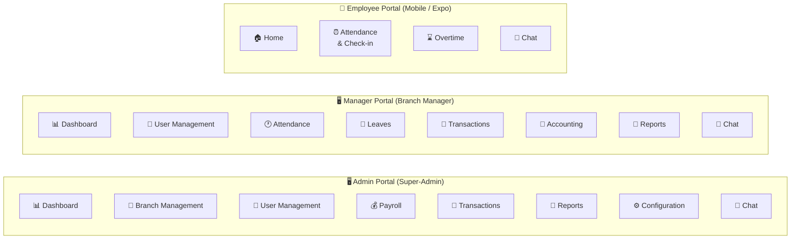
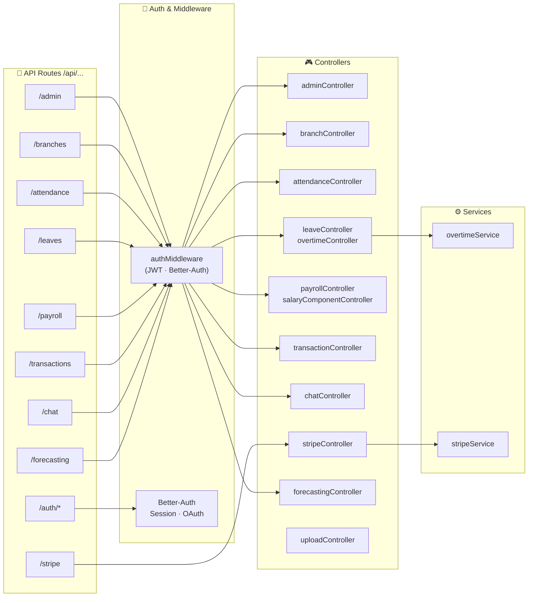
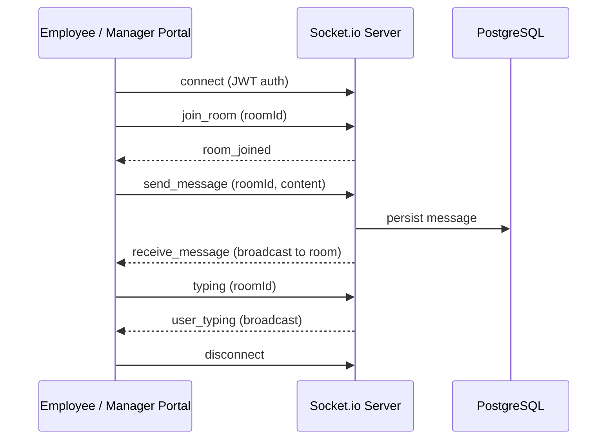
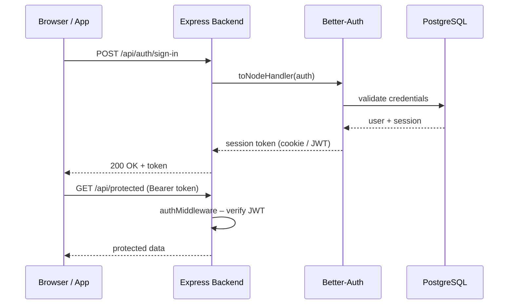
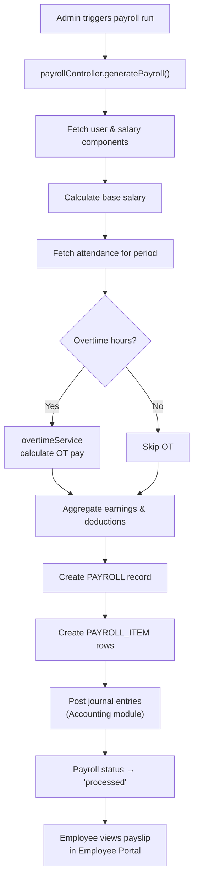
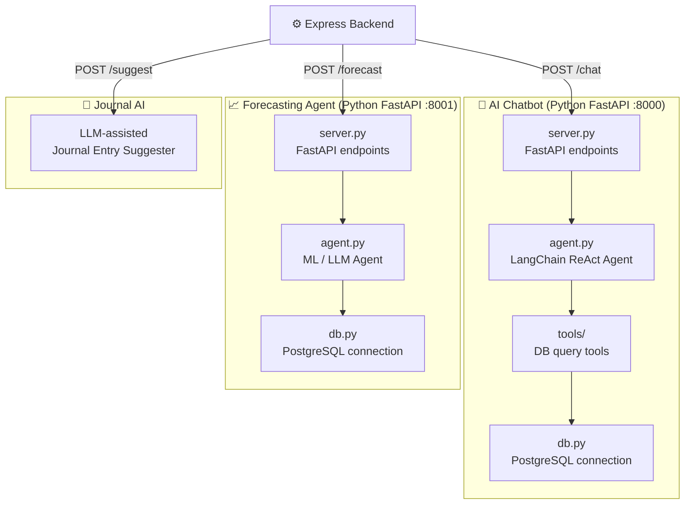
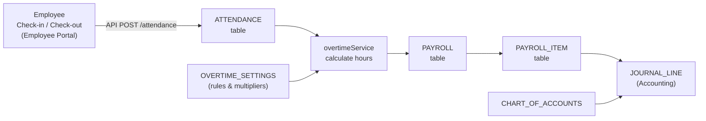
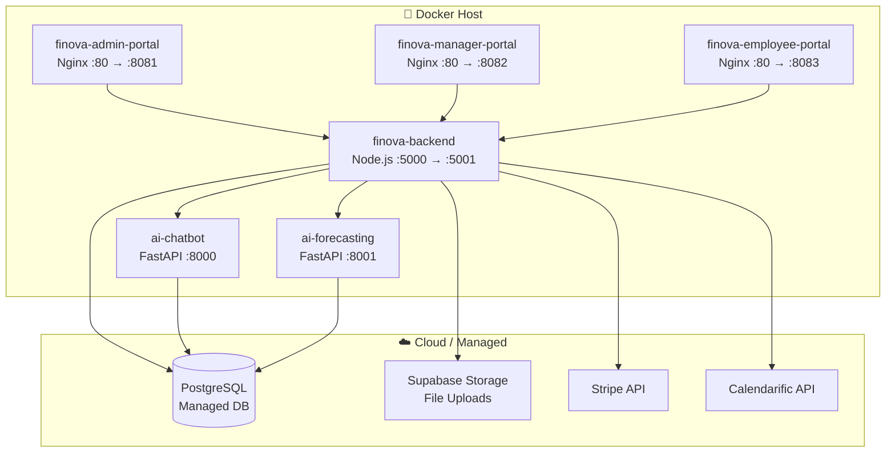
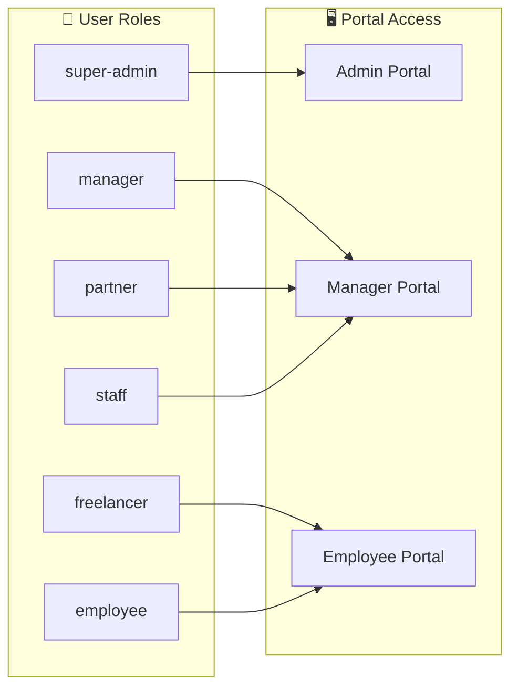

# Finova – High-Level Architecture

This document describes the complete high-level architecture of the Finova platform using Mermaid diagrams.

---

## 1. System Overview

---

## 2. Frontend Portals – Feature Map

---

## 3. Backend – API Route & Controller Map

---

## 4. Real-Time Communication – Socket.io Flow

---

## 5. Authentication & Session Flow

---

## 6. Payroll Processing Flow

---

## 7. AI Services – Internal Architecture

---

## 8. Data Flow – Attendance to Payroll

---

## 9. Deployment Topology (Docker)

---

## 10. Role-Based Access Control

