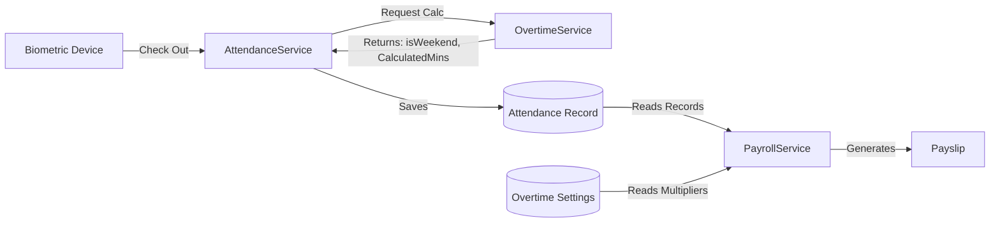

# Finova Payroll System

This document outlines the interconnected logic for Payroll generation, Time & Attendance, and Overtime processing in the Finova system.

## 🔄 System Overview

The payroll system is **fully interconnected** with the Attendance and Overtime modules. Earnings are dynamically calculated every month using:
1.  **Biometric Data**: Real-time check-in/out records from the `attendance` table.
2.  **Smart Overtime Service**: Auto-detection of Weekends and Holidays.
3.  **Global Settings**: Configurable overtime multipliers fetched from the `overtime_settings` table.

## ⚙️ Payroll Generation Engine

The core payroll processing is handled by the `bulkGeneratePayroll` endpoint (`POST /payroll/bulk`). It operates through a multi-step batch process:

1. **Fetch Active Employees**: Queries the `user` table for all active users with the `Employee` role.
2. **Attendance Aggregation**: For each employee, the engine filters `attendance` records for the selected month and aggregates total worked days, standard hours, and overtime minutes.
3. **Draft Generation**: The engine provisions a new `Draft` record in the `payroll` table, consolidating total earnings, deductions, and net salary.
4. **Itemization**: Detailed line items (Basic Salary, specific allowances, taxes, EPF contributions) are inserted into the `payroll_item` table.
5. **Safety Checks**: The engine prevents the regeneration of any payroll record that has already been marked as `Approved` or `Paid`.

## 🗄️ Database Use Cases (Schema)

The engine relies on specific interactions with the database (via Drizzle ORM):

*   **`user` (Read)**: Identifies active employees and fetches core parameters (`baseSalary`, `salaryType`).
*   **`overtime_settings` (Read)**: Retrieves global OT multipliers.
*   **`attendance` (Read)**: The definitive source for hours worked and accrued overtime per period.
*   **`payroll` (Write/Update)**: Stores the master payslip record with rolled-up financial totals.
*   **`payroll_item` (Write/Delete)**: Stores individual line items for the payslip (e.g., allowances, deductions).

> **Note on Salary Components:** 
> The schema includes `salary_component` (for global compensation rules) and `employee_salary_component` (for user-specific overrides). However, in the current iteration, these database calls are **mocked** in the backend using arrays. The engine simulates standard allowances and deductions directly via code rather than querying these relational tables.

## 💰 Salary Types

The system supports three distinct salary structures, configured per user in the `user` table (`salaryType` field).

### 1. Fixed Salary with Overtime (`FixedWithOvertime`)
*   **Base Pay**: Fixed Monthly Salary.
*   **Overtime**: Paid.
*   **Hourly Rate**: `Base Salary / 240` (Standard 240 hours/month).

### 2. Fixed Salary without Overtime (`FixedNoOvertime`)
*   **Base Pay**: Fixed Monthly Salary.
*   **Overtime**: **Not Paid** (ignored even if worked).
*   **Hourly Rate**: N/A.

### 3. Daily Wages (`Daily`)
*   **Base Pay**: `Daily Rate * Days Worked`.
*   **Overtime**: Paid.
*   **Hourly Rate**: `Daily Rate / 8` (Standard 8 hours/day).

## ⏱️ Overtime Logic

Overtime is calculated **dynamically** per attendance record.

1.  **Detection**: The system automatically flags records as `isWeekend` or `isHoliday` based on the calendar and system settings.
2.  **Calculation**:
    *   **Minutes**: Uses `calculatedOvertimeMinutes` rather than raw hours.
    *   **Multipliers**: Fetched from `overtime_settings` table.
        *   **Weekday**: Default `1.25x`
        *   **Weekend**: Default `2.0x`
        *   **Holiday**: Default `2.0x`

> **Formula**:
> `Overtime Pay = (OT Hours * Hourly Rate * Dynamic Multiplier)`

## 📉 Statutory Deductions

Deductions are automatically calculated based on the **Base Earnings** (ignoring Overtime).

*   **EPF (Employee)**: 8% of Base Earnings (Deducted from Net Salary).
*   **EPF (Employer)**: 12% of Base Earnings (Company Cost).
*   **ETF (Employer)**: 3% of Base Earnings (Company Cost).

## 📝 Example Calculation

**Scenario**: User (Fixed Salary, 48,000 LKR) works 2 hours on a Friday and 5 hours on a Saturday.

1.  **Hourly Rate**: `48,000 / 240 = 200 LKR/hr`.
2.  **Friday (Weekday)**:
    *   2 hours * 200 * **1.25** = 500 LKR.
3.  **Saturday (Weekend)**:
    *   5 hours * 200 * **2.0** = 2,000 LKR.
4.  **Total Overtime**: `2,500 LKR`.
5.  **EPF (8%)**: `48,000 * 0.08 = 3,840 LKR`.
6.  **Net Salary**: `(48,000 + 2,500) - 3,840 = 46,660 LKR`.
