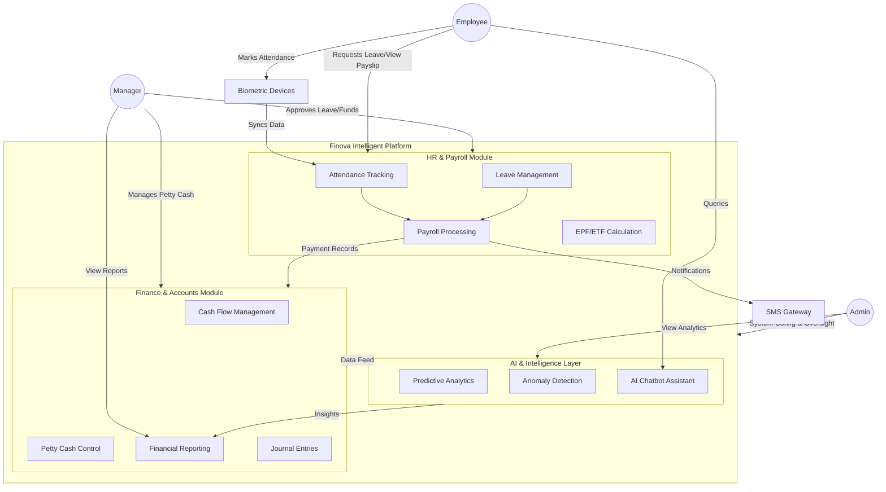

# Finova Intelligent Platform

Finova is a comprehensive Finance & HR application designed to streamline company operations with role-based access for Employees, Managers, and Admins. It seamlessly integrates HR, Payroll, Financial Accounting, and an AI Intelligence layer into a single unified system.

## Key Features & Modules

- **Employee Portal**: Mark attendance, submit leave requests, view payslips, and interact with an AI Chatbot assistant.
- **Manager Portal**: Approve leave/funds, manage petty cash, view team and financial reports, and communicate via support chat.
- **Admin Portal**: System configuration, user and role management, financial rules oversight, and AI-driven predictive analytics.
- **Backend Architecture**: A single unified API gateway with role-based access control (RBAC), isolated finance logic, and mandatory audit logging.

## Recent Updates

- **Manager Portal Chat**: Implemented comprehensive chat support mirroring the admin functionality.
- **Employee Portal Connectivity**: Resolved authentication and network configuration issues to restore backend communication.
- **Leave Management Fixes**: Corrected data fetching to ensure all pending leave requests are properly displayed in the Leave Activity table.
- **Financial Reports Integration**: Added a full-featured Financial Reports page to the Manager Portal including Profit & Loss Statements, Balance Sheets, Trial Balances, and Transaction Status summaries.

## Getting Started

### Option 1: Local Setup

1. **Install Dependencies**: Ensure you have installed dependencies in the root, backend, and frontend directories.
   ```bash
   npm setup
   ```
2. **Run the Application**: Start all services in parallel from the root directory.
   ```bash
   npm start
   ```

**Local Ports**:
- **Backend API**: `http://localhost:5000`
- **Admin Portal**: `http://localhost:5175`
- **Manager Portal**: `http://localhost:5176`

### Option 2: Docker Setup

The project is fully dockerized for the Backend, Admin, Manager, and Employee portals.

1. **Configure Environment**:
   ```bash
   cp backend/.env.example backend/.env
   ```
2. **Build and Run**:
   ```bash
   docker compose up --build -d
   ```

**Docker Ports**:
- **Backend API**: `http://localhost:5001`
- **Admin Portal**: `http://localhost:8081`
- **Manager Portal**: `http://localhost:8082`
- **Employee Portal**: `http://localhost:8083`

*(Note: Stop services with `docker compose down` and view logs with `docker compose logs -f`)*

## System Architecture


