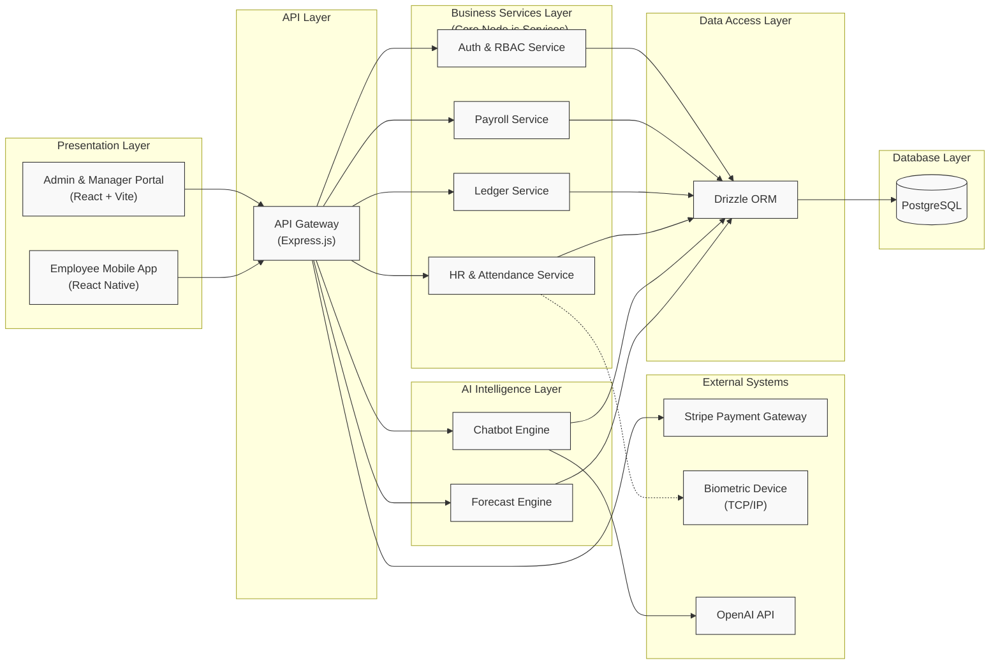

# Finova - Structured Layered Architecture

```mermaid
flowchart LR
    subgraph PresentationLayer["Presentation Layer"]
        direction TB
        AMP["Admin & Manager Portal\n(React + Vite)"]
        EMA["Employee Mobile App\n(React Native)"]
    end

    subgraph APILayer["API Layer"]
        AG["API Gateway\n(Express.js)"]
    end

    subgraph BusinessLayer["Business Services Layer\n(Core Node.js Services)"]
        direction TB
        AUTH["Auth & RBAC Service"]
        PAY["Payroll Service"]
        LED["Ledger Service"]
        HR["HR & Attendance Service"]
    end

    subgraph AILayer["AI Intelligence Layer"]
        direction TB
        CB["Chatbot Engine"]
        FE["Forecast Engine"]
    end

    subgraph ExternalLayer["External Systems"]
        direction TB
        STRIPE["Stripe Payment Gateway"]
        BIO["Biometric Device\n(TCP/IP)"]
        OAI["OpenAI API"]
    end

    subgraph DataAccessLayer["Data Access Layer"]
        ORM["Drizzle ORM"]
    end

    subgraph DBLayer["Database Layer"]
        DB[("PostgreSQL")]
    end

    %% Connections from Presentation
    AMP --> AG
    EMA --> AG

    %% Connections from API Gateway
    AG --> AUTH
    AG --> PAY
    AG --> LED
    AG --> HR
    AG --> STRIPE
    AG --> CB
    AG --> FE

    %% Connections to Data Access
    AUTH --> ORM
    PAY --> ORM
    LED --> ORM
    HR --> ORM
    CB --> ORM
    FE --> ORM

    %% Connections with External Systems
    HR -.-> BIO
    CB --> OAI

    %% Data Access to Database
    ORM --> DB

    %% Styling
    classDef default fill:#f9f9f9,stroke:#333,stroke-width:1px;
    classDef layer fill:#fff,stroke:#000,stroke-width:1.5px;
```
