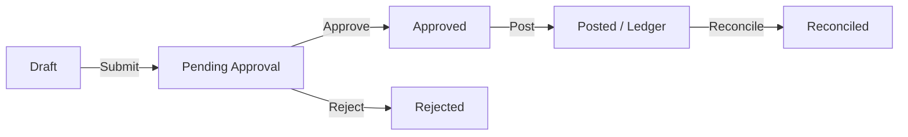
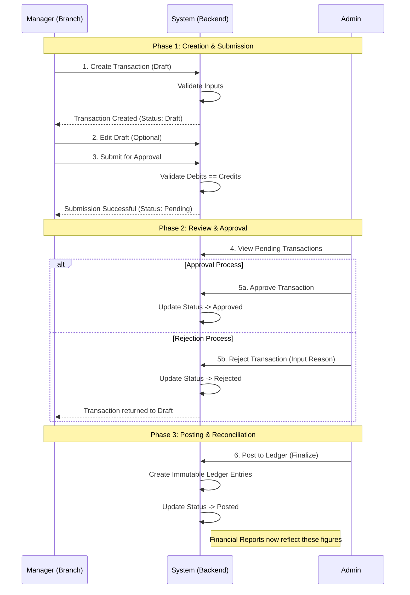

# Transaction Management System

This document outlines the implementation logic for the Transaction Management System in the Finova backend.

## 1. Accounting Logic (Double-Entry)

The system enforces Double-Entry Accounting principles. Every transaction must have equal Debits and Credits.

### Transaction Types & Journal Entries

When a Manager creates a transaction via the portal, the backend automatically generates the corresponding journal lines:

| Transaction Type | User Input | Backend Journal Entry (Generated) | Note |
| :--- | :--- | :--- | :--- |
| **Payment** | Selects "Expense Account" | **Debit**: Expense/Liability Account | Money leaving the business |
| | Selects "Paid From" (Asset) | **Credit**: Asset Account (Cash/Bank) | |
| **Receipt** | Selects "Deposit To" (Asset) | **Debit**: Asset Account (Cash/Bank) | Money entering the business |
| | Selects "Income Source" | **Credit**: Revenue/Equity Account | |
| **Journal/Transfer** | Manual Entry | **Debit**: User Selected | Standard Journal |
| | Manual Entry | **Credit**: User Selected | Must Balance |

## 2. Authentication & Role Handling

Access to transaction routes is restricted based on roles.

### Roles
-   **Admin**: Full access to View, Approve, Reject, and Post transactions.
-   **Manager (Branch)**: Restricted access to Create, Edit (Draft only), and Submit transactions.

### User vs. Branch Identity
The system handles two types of logins for creating transactions:
1.  **Employee/User Login**: The `createdBy` field is set to the **User ID**.
2.  **Branch Login (Manager Portal)**:
    -   Branches authenticate directly (not as a specific named user).
    -   The backend detects `req.user.role === 'branch'`.
    -   In this case, `created_by` is set to `NULL` (indicating a system/branch action), and the `branch_id` is set to the authenticated Branch ID.
    -   *Fix implemented*: Prevents "Foreign Key Violation" when a Branch tries to save its ID into the User table.

## 3. Transaction Lifecycle

The transaction status flows through a strict lifecycle to ensure data integrity and maker-checker validation.

1.  **Draft**: Editable by the creator. Not visible in financial reports.
2.  **Pending Approval**: Locked for editing. Awaiting Admin review.
3.  **Approved**: Validated by Admin. Ready for posting.
4.  **Rejected**: Sent back with a reason. Can be edited and re-submitted.
5.  **Posted**: Written to `ledger_entry` table. Immutable. Affects financial reports.
6.  **Reconciled**: Matched against bank statements.

## 4. Database Schema

Key tables involved:

-   `transaction`: Header information (Date, Description, Status, Branch).
-   `journal_line`: The individual debit/credit lines linked to `chart_of_accounts`.
-   `ledger_entry`: Permanent records created only after "Posting".
-   `chart_of_accounts`: The source of truth for all financial accounts.

## 5. API Endpoints

-   `POST /api/transactions`: Create new transaction (Auto-calculates journal lines).
-   `PUT /api/transactions/:id`: Update transaction (Only if Draft).

## 6. Process Flow (Swimlane)

This sequence diagram illustrates the interactions between the Manager, the System, and the Admin.

