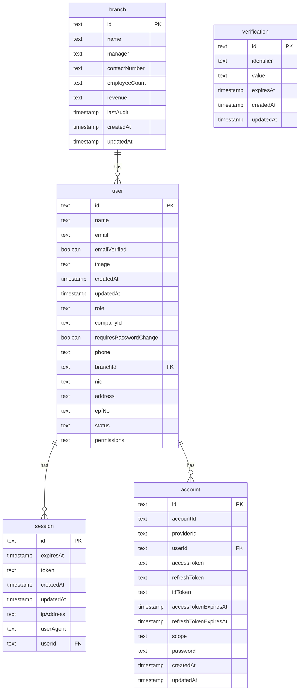

# Database Schema Documentation

This directory contains the database schema definitions for the application, using Drizzle ORM.

## Schema Overview

The database consists of the following main tables:
- **user**: Stores user information including authentication details, profile data, and permissions.
- **session**: Manages user sessions.
- **account**: Handles OAuth accounts and linkage to users.
- **verification**: Stores verification tokens for email/phone verification.
- **branch**: Stores branch information.

## Entity Relationship Diagram

## Files
- `schema.ts`: The Drizzle ORM schema definition file.
