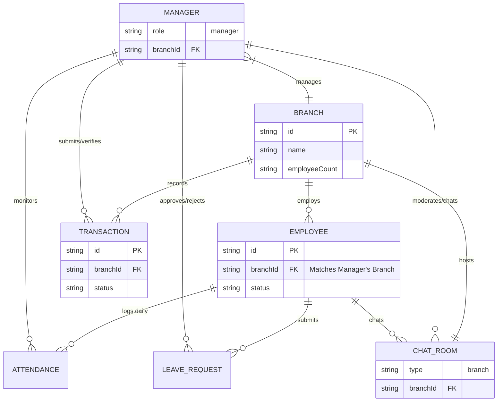

# Manager Portal - Architecture & Data Flow

This diagram illustrates the localized scope of the Manager Portal within the Finova platform. Unlike the Admin Portal which has global visibility, a Manager's view is strictly bounded by their assigned `Branch`.

## Entity Relationship Diagram (Branch-Scoped)

## Data Flow & Permissions
1. **Authentication:** When a Manager logs in, the backend identifies their `branchId`.
2. **HR Operations:** Controllers (`attendanceController.ts`, `leaveController.ts`) filter queries to only return records belonging to `USER`s with a matching `branchId`.
3. **Accounting:** The `transactionController.ts` restricts the Manager to creating and viewing transactions tagged with their `branchId`. High-value transactions often enter a `Pending` state for Admin approval (Maker-Checker workflow).
4. **Chat:** The Manager automatically has access to the `CHAT_ROOM` linked to their `branchId` to communicate with their team.
